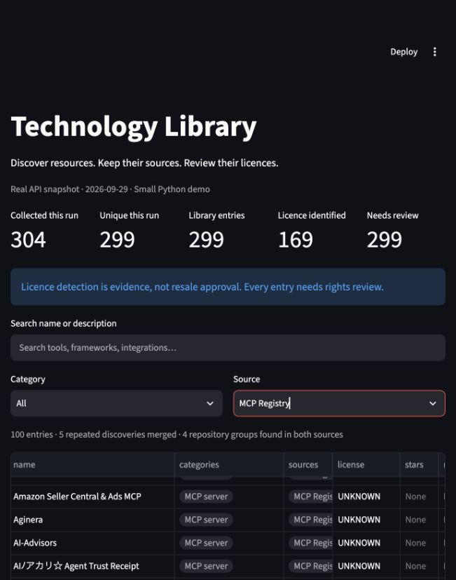

# Technology Library — a small discovery demo

A functional Python demo that discovers public technology resources, removes repeated entries, preserves their sources and exposes licence evidence for review.

**Two application files. No classes, LLM, database server, containers or background services.** The included real dataset lets you explore the result immediately, without a token or fresh API calls.



## What it demonstrates

```text
GitHub topic searches + official MCP Registry
                    ↓
            Save the raw responses
                    ↓
       Normalize names, links and metadata
                    ↓
       Merge repeated resource identities
                    ↓
       Group entries sharing a repository
                    ↓
         Record available licence evidence
                    ↓
       Search the library / export CSV and JSON
```

The central question is not “how many URLs can we collect?” It is “can we explain what each record represents, where it came from and what still needs checking?”

## Actual sample results

Collected on **29 September 2026**, using public API responses. These are measured sample results, not estimated production volumes.

| Measure | Result |
|---|---:|
| GitHub topic-search discoveries | 200 |
| MCP Registry discoveries | 100 |
| Additional GitHub repositories followed from registry links | 4 |
| Total raw discoveries | 304 |
| Repeated discoveries merged | 5 |
| Unique library entries | 299 |
| Repository or standalone groups | 277 |
| Groups with entries from both sources | 4 |
| Entries with a recognised licence identifier | 169 |
| Direct licence files retrieved | 10 |
| Entries requiring rights review | 299 |
| Manually verified entries | 0 |

Five registry repository links were attempted. One returned HTTP 404 and is recorded in `data/raw.json` under `unavailable_repository_links`.

The 277 groups are **not a count of verified unique products**. Several different tools can share a repository, and a publisher can supply an inaccurate repository link. The demo preserves these distinctions.

## Quick start

Use Python 3.10 or newer. This snapshot was tested with Python 3.14.5, requests 2.34.2 and Streamlit 1.64.0.

```bash
git clone https://github.com/RuddiRodriguez/product-library-demo.git
cd product-library-demo
python3 -m venv .venv
source .venv/bin/activate
pip install -r requirements.txt
streamlit run app.py
```

On Windows, activate with `.venv\Scripts\activate` instead.

Open the local address printed by Streamlit. The screen reads the included files; it does not call either API. No account, token or paid service is needed to view the saved sample.

### A two-minute walkthrough

1. Look at the discovery and licence counts at the top.
2. Filter by **MCP server**, **AI agent**, or **Linked repository**.
3. Search for `tandem`. Its registry entry and GitHub repository remain separate, connected by their shared repository link.
4. Select an entry to inspect its description, evidence and full discovery sources.
5. Open a GitHub entry with a licence-file link. Compare its detected licence with its separate `REVIEW REQUIRED` status.
6. Download the full library as CSV or JSON. Downloads contain the complete library, regardless of the current screen filters.

## Run a fresh discovery

```bash
python pipeline.py
```

The default run requests:

- Up to 100 repositories for `topic:mcp-server archived:false`, ordered by stars.
- Up to 100 repositories for `topic:ai-agents archived:false`, ordered by stars.
- Up to 100 latest-version entries from the official MCP Registry, following its next-page cursor when necessary.
- Repository metadata for the first five distinct GitHub links in that registry sample.
- Licence files for the first ten distinct repositories discovered on GitHub.

The registry sample follows the API's listing order. It is not a popularity ranking or a representative sample of the entire registry.

For a smaller run:

```bash
python pipeline.py --count 20
```

`--count` applies to each of the two GitHub searches and to the registry sample, not to the final total. Its allowed range is 1–100. The five linked-repository lookups and ten licence-file checks are separate caps.

GitHub accepts unauthenticated public requests, but its rate limits are lower. If you already use GitHub CLI, you can supply its token only to this command:

```bash
GITHUB_TOKEN="$(gh auth token)" python pipeline.py
```

Alternatively, set `GITHUB_TOKEN` through your shell or secret manager. The script sends it only to `api.github.com`; it never writes the token into output files. No token is included in this repository.

Requests run sequentially. A timeout or API error stops the run; there is no retry framework. A 404 on a linked repository or licence file is treated as unavailable evidence. The script does not bypass access restrictions or install any discovered tools.

## Replay without network access

```bash
python pipeline.py --offline
```

This rebuilds the outputs from `data/raw.json` and updates the existing library by stable resource identity. Running the same snapshot twice does not create extra entries. Its original collection timestamp remains unchanged: replay is not a fresh source check.

To collect an independent sample without modifying the included one:

```bash
python pipeline.py --count 20 --output scratch
```

The app always reads `data/`. An alternative output folder is for command-line exploration; it does not automatically change the app's dataset.

## How the code works

### Small functions and plain records

`pipeline.py` contains API calls, normalization, merging and export. Each resource is an ordinary dictionary. `app.py` reads the saved files and adds search, filters, record inspection and downloads.

There are no custom classes or application framework layers. JSON files keep the demo easy to inspect. PostgreSQL would make sense for a larger system, but is unnecessary for this sample.

### Deduplication versus grouping

- GitHub entries use GitHub's numeric repository ID. The same repository found in both topic searches becomes one entry, keeping both category labels and discovery URLs.
- MCP entries use their registry name. Fetching a later version updates the same entry.
- Related entries share a `group_id` based on their normalized repository URL. GitHub URL casing, query strings and a trailing `.git` are normalized.
- Different registry names stay separate even when they point to the same repository. Registry entries do not inherit a repository's licence automatically.
- Without a repository URL, an entry forms its own group.

For example, `ac.tandem/docs-mcp` and `frumu-ai/tandem` are connected in this snapshot. Conversely, several registry entries point to the registry's own repository: that link alone is not enough to declare them the same product.

### Categories

Categories come from the discovery route, not an AI classifier. A repository found through the AI-agent topic gets `AI agent`; registry entries get `MCP server`; repositories followed from registry links get `Linked repository`. These are discovery labels, not independently verified classifications.

### Licence evidence

For GitHub entries, the demo records GitHub's reported SPDX licence identifier and the repository API URL as its evidence source. For the ten direct file checks, it records the actual returned licence-file URL instead. Their full API responses, including file content and file SHA when returned, remain in the raw snapshot.

`UNKNOWN` means no licence identifier was available. `NOASSERTION` means GitHub did not identify a standard licence; it does not mean there are no terms.

The demo does **not** infer commercial-use, modification, redistribution or white-label rights. All entries remain `REVIEW REQUIRED`, including entries reporting MIT or Apache licences. GitHub's detection does not evaluate dependency licences or every possible source of project terms. See [GitHub's licence API explanation](https://docs.github.com/en/rest/licenses/licenses).

### Repeated runs

New entries are added and existing entries are updated. `first_seen` is retained, `last_checked` reflects the incoming snapshot, and previously observed categories and discovery URLs are kept. Entries missing from a later bounded sample remain in the library; absence from a sample does not establish deletion.

`raw.json` contains only the latest completed discovery snapshot. It is overwritten on refresh. The library accumulates entries, so older entries can outlive their raw snapshot. This demo is not a historical evidence archive and should not have concurrent writers.

## Saved files and fields

| File | Contents |
|---|---|
| `pipeline.py` | Discovery, cleaning, merging and export |
| `app.py` | Searchable Streamlit interface |
| `test_demo.py` | Four focused functional checks |
| `data/raw.json` | Latest raw records, collection time, licence responses and unavailable links |
| `data/library.json` | Normalized, accumulated library |
| `data/library.csv` | Same library, with list fields separated by a vertical bar |
| `data/summary.json` | Counts for the last run and current library |

Each normalized record contains its ID, name, description, source-entry URL, repository URL, creator, categories, source names, discovery URLs, language, tags, stars when available, source update time, licence identifier, evidence URL/type, rights-review status, group ID, first discovery time and last check time.

For registry entries, `creator` is the registry namespace rather than a verified legal entity. Registry update times describe the listing; GitHub update times are the last repository push. Stars are absent for registry entries rather than invented or borrowed from linked repositories.

## Verification

```bash
pip install pytest
python -m pytest -q
```

Four checks passed for the included version:

1. Repeated discovery updates a record while preserving original discovery time and sources.
2. Different server identities sharing a repository are not incorrectly merged.
3. Two offline runs produce identical library output, with no duplicate IDs or automatic rights approvals.
4. The app loads, filters registry entries and handles a search with no matches.

The real collection run and browser preview were also checked. No million-record load test was performed.

## Deliberate limits

This is a working sample of discovery and traceability, not the complete production library described in a large-scale brief. It does not include scheduled execution, full-source coverage, semantic duplicate detection, relevance or quality scoring, security analysis, legal approval, database infrastructure or monitoring. It collects metadata and limited licence evidence, not third-party software packages.

For production, the next steps would be persistent storage with history, scheduled source updates, broader source coverage and a separate evidence-based review process. Those steps should be scoped and measured independently from this demo.

## Sources

- [GitHub repository search API](https://docs.github.com/en/rest/search/search#search-repositories)
- [GitHub licence API](https://docs.github.com/en/rest/licenses/licenses)
- [Official MCP Registry API](https://github.com/modelcontextprotocol/registry/blob/main/docs/reference/api/official-registry-api.md)

Third-party descriptions, metadata and licence documents retain their original ownership and applicable terms. Inclusion in this sample does not grant rights to the listed resources.
